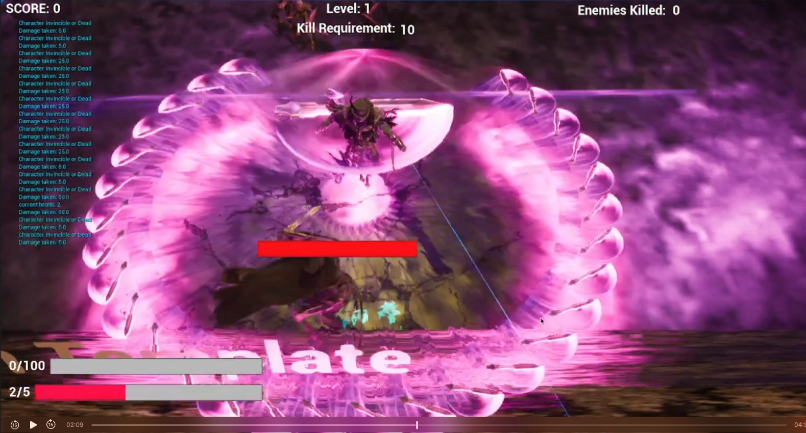

# CyberKNight

Welcome to my 3D platform action game! In this game, you will experience intense combat and the thrill of dodging a barrage of projectiles. Here are the key features of the game:

## Gameplay

### Combat and Dodging
- **Combat**: Players will engage in battles with various enemies on screen, utilizing a range of skills and equipment to defeat them.
- **Dodging**: The game will feature numerous projectiles that players must skillfully dodge, similar to bullet hell games.

### Upgrades and Equipment
- **Purchasing Upgrades**: Players can buy upgrades and equipment from merchants or stores within levels or between levels. These upgrades can enhance player stats or provide new skills and abilities.
- **Challenge Unlocks**: Some skills will be locked behind specific challenges, such as defeating enemies in a certain way or within a time limit.

### Energy System
- **Battery System**: Player skills will be governed by a "battery" system, with more powerful skills consuming more battery charges.
- **Charging Methods**: Charges can replenish over time or be linked to performing exciting moves, such as quickly killing multiple enemies.

## Visual Style

### Cyberpunk Elements
- **Environment Design**: The game will embrace a cyberpunk aesthetic, leveraging UE5’s lighting and material rendering systems to create dark environments illuminated by neon lights and reflections.

I hope you find joy in this world filled with challenges and thrills, enjoying the combat and dodging mechanics, and growing stronger through continuous upgrades and new skill unlocks. Are you ready to start your adventure? Dive into this cyberpunk-themed 3D platform action game now!

[Watch the video](https://github.com/Luo-hongyi/Cyberknight/raw/main/cyberknight.mp4)
